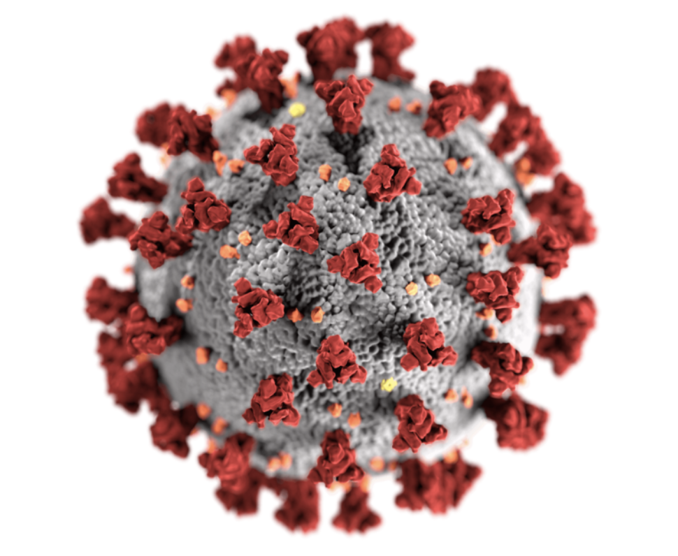

# SARS-CoV-2-Genomic-Analysis

## Project Overview: 

This project presents a comprehensive genomic analysis of various SARS-CoV-2 variants, offering a deep dive into the genetic diversity of the virus responsible for the COVID-19 pandemic. By examining the genomic sequences of different variants, this research uncovers patterns and trends that are crucial for understanding the virus's evolution and its implications for public health.

## Purpose

The primary aim of this project is to leverage bioinformatics tools and data analytics to analyze the genomic data of SARS-CoV-2 variants. The insights gained from this analysis are intended to inform public health strategies, support the development of targeted medical interventions, and contribute to the global understanding of the virus's behavior and spread.

## Key Features

* Genome Sequence Retrieval: Automated fetching of genomic sequences from NCBI databases, focusing on various SARS-CoV-2 variants.
* Data Analysis: Comprehensive analysis including sequence length calculations, nucleotide composition assessment, and GC content evaluation.
* Visualization: Graphical representation of genomic data to highlight key findings and trends in an accessible manner.
* Insight Generation: Extraction of actionable insights to guide public health decisions and medical research.

## Technology Stack

* R Programming Language: Utilized for all data processing and analysis tasks, thanks to its robust statistical computation capabilities.
* rentrez and Biostrings Libraries: Employed for efficient data retrieval from NCBI databases and handling of biological string data.
* Data Visualization Tools: Leveraged within R for generating insightful plots and charts to illustrate the analysis results.

## Conclusion

This project underscores the importance of genomic analysis in understanding pathogens like SARS-CoV-2. By dissecting the genetic makeup of various virus variants, it provides a foundation for informed decision-making in public health and medical research. The insights gleaned from this study not only contribute to the scientific community's knowledge pool but also highlight the pivotal role of data-driven methodologies in combating global health crises.

